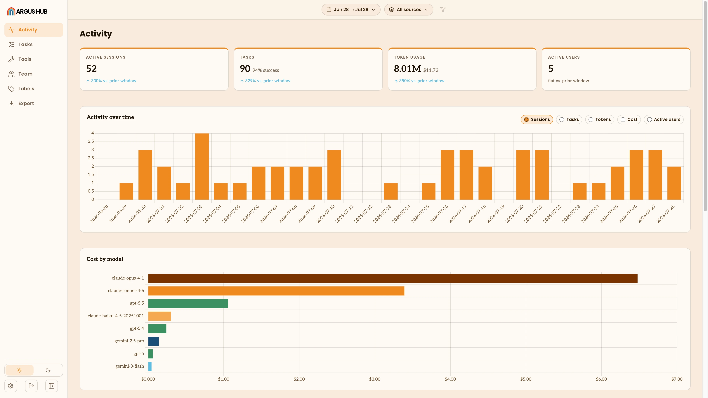

# Argus Hub

Argus Hub is a self-hosted server that pools usage data from a team's
[Argus](https://github.com/Agent-Deployment-Co/argus) clients into one org-wide dashboard. Each Argus Hub aggregates session and task data into a centralized dashboard. Argus Hub runs entirely on your own network.

Argus Hub is free to self-host, including commercially, and source-available under the Functional
Source License (see [License](#license)), converting to MIT two years after each release.



## Quick start

**Requirements:** Node.js ≥ 20.17 (or Bun ≥ 1.0).

```bash
export HUB_SECRET_KEY="$(openssl rand -base64 32)" # save this value
npx @agentdeploymentco/argus-hub serve --port 4343
```

`HUB_SECRET_KEY` is optional. Without it, Argus Hub starts with a warning and disables API-key-based
LLM providers. Set it in your deployment's secret manager to enable those providers; it encrypts
task-provider API keys and must remain stable across restarts.

On first startup, Argus Hub creates `data/hub.db`, generates a sync API key and a random admin password, and prints them once:

```
Admin password: 4f2c8a91b7e3d6502a1c9f48de07b3a5
Hub API key (Default): hub-550e8400-e29b-41d4-a716-446655440000
```

Both are only shown at this moment — copy them somewhere safe before scrolling past. The
**API key** authenticates `argus sync` uploads. The **admin password** gates the dashboard
login at `http://localhost:4343/login`. Set `ADMIN_PASSWORD` in the environment to pin it
across restarts; otherwise a fresh random password is generated each launch.

## Connecting clients

On each developer's machine, point the client at Argus Hub and store the API key in the OS secret
store (never in plaintext config):

```bash
npx @agentdeploymentco/argus config set hub.url http://hub.internal:4343
npx @agentdeploymentco/argus secret set ARGUS_HUB_KEY   # prompts for the key, never touches argus.json
```

To configure a single process instead (e.g. CI, a container), use the environment variable pair:

```bash
export ARGUS_HUB_URL=http://hub.internal:4343
export ARGUS_HUB_KEY=hub-550e8400-e29b-41d4-a716-446655440000
```

Key resolution order is `ARGUS_HUB_KEY` env var → OS secret store → unset. Putting `hub.key`
directly in `argus.json` also still works, but it's a legacy path the client actively migrates
users off of — `hub.key` is marked `secret: true`, and a one-time migration moves any plaintext
key it finds out of `argus.json` and into the secret store. Prefer `secret set` above.

With Argus Hub configured, `argus sync` posts a JSON payload of resolved session rows to Argus Hub
instead of the hosted service. No `argus login` / OAuth flow is needed. Argus Hub identifies each
user from the client's latest identity signal — Claude/Codex OAuth email when present, falling
back to `git.user.name` — and folds repeat clients from the same person into a single user
(the underlying table is named `fingerprint`, but that's an implementation detail).

The desktop app (macOS/Windows) offers the same connection under Settings → Argus Hub URL + key, and
uploads on a schedule automatically. From the CLI, `argus run` also syncs on a built-in five-minute
schedule; use `--sync-interval N` to change it or `--no-sync` to disable it and rely on manual
`argus sync` calls.

## Configuration

Argus Hub reads config from `hub.json`, then environment variables, then CLI flags — highest
precedence last.

| CLI flag | Env var | Config key | Default | Description |
|----------|---------|-----------|---------|-------------|
| `--port` | `HUB_PORT` | `port` | `4343` | Port to listen on |
| `--data-dir` | `HUB_DATA_DIR` | `dataDir` | `./data` | Directory for `hub.db` |
| —        | `HUB_SECRET_KEY` | — | _(optional)_ | Base64 encoding of 32 random bytes; enables and encrypts API-key-based task providers |
| —        | `ADMIN_PASSWORD` | —     | _(random)_ | Dashboard login password (pinned across restarts when set) |
| —        | `HUB_INSECURE_COOKIE_HOSTS` | — | _(none)_ | Comma-separated hostnames (no port) that get a non-`Secure` session cookie, for plain-HTTP-only internal deployments. **Never** list a host reachable from the public internet |

`GET /healthz` always returns `200 ok` unauthenticated, for load balancer / orchestrator health checks.

**Client compatibility:** Argus Hub ingests client store schema versions v10–v23
(`HUB_MIN_CLIENT_SCHEMA_VERSION` / `HUB_MAX_CLIENT_SCHEMA_VERSION`). A client outside that range
gets a `422` with an actionable message — update Argus Hub if the client is newer than Argus Hub supports, or
run `argus index` to migrate if the client's store is older than Argus Hub's minimum.

Example `hub.json`:

```json
{
  "port": 4343,
  "dataDir": "/var/lib/argus-hub"
}
```

There is no `HUB_KEY` setting — API keys live in `hub.db` and are managed there. On first
startup, if the `api_keys` table is empty, Argus Hub generates a `hub-{UUID}` key linked to the
Default org and prints it to stdout.

### Task LLM settings

Administrators can open **Settings → General** to select and configure one of these providers:
Anthropic API, a host command, Google Gemini, OpenAI, or OpenRouter. This connection is reserved for
future organization task-labeling features — nothing in Argus Hub calls it yet beyond the Settings
page's own "Test connection" check. The provider begins blank, and settings, along with encrypted
API keys, are scoped to the current organization. Provider environment variables such as
`OPENAI_API_KEY` are not read.

API keys entered in Settings are encrypted in SQLite with AES-256-GCM using `HUB_SECRET_KEY`.
Back that key up separately from `hub.db`: changing or losing it makes existing provider keys
unreadable, and recovery means restoring the original key or replacing every saved provider key.
Generate one with `openssl rand -base64 32`.

The **Command** provider runs the configured command directly on the Argus Hub host, with the prompt
on stdin and completion on stdout — administrator-controlled remote code execution. Enable it
only when Argus Hub administrators and the configured command are fully trusted.

## API keys

Keys are stored in `hub.db` **hashed** (`key_hash`, via `hashApiKey()`) — the printed key is the
only time the plaintext value exists anywhere.

To rotate a key: delete the old row from `api_keys` directly in `hub.db`, then restart Argus Hub. A
new key will be generated and printed on startup if the table is now empty. Disabling a key
(below) instead of deleting it does **not** trigger a new key on restart — Argus Hub only mints one
when the `api_keys` table has no rows at all.

To disable a key without deleting it (e.g. while rotating), set `is_enabled = 0` in `hub.db`.
Argus Hub rejects disabled keys with `401` before reading the request body.

## Running as a service

Docker is the recommended path for anything beyond local testing — see **[DOCKER.md](DOCKER.md)**
for building/pulling the image, environment variables, Compose, health checks, persisting data,
and running behind a reverse proxy:

```bash
docker pull ghcr.io/agent-deployment-co/argus-hub:latest
docker run -d --name argus-hub -p 4343:4343 -v argus-hub-data:/data \
  ghcr.io/agent-deployment-co/argus-hub:latest
docker logs argus-hub 2>&1 | grep -E "Hub API key|Admin password"
```

To run Argus Hub directly on a host instead, see **[DEPLOYMENT.md](DEPLOYMENT.md)** for systemd
(Linux) and launchd (macOS) unit files.

## Features

Argus Hub's dashboard runs in your browser at `http://hub.internal:4343`, the same UI as
`argus serve` with a user/group dimension layered on top:

- **Activity** is the home view: usage and cost over time, org-wide or scoped to a user or group.
- **Tasks** are the things people asked agents to do, each with a judged outcome, frustration and
  interrupted rates, and top failure signals.
- **Tools** shows tool, skill, and MCP server usage across the org.
- **Team** is a per-user summary — sessions, total tokens, estimated cost, last-sync time — with
  optional grouping for reporting.
- **Labels** manages hub-level task labels — distinct from any labels an Argus client applies
  itself — and applies them to tasks from the Tasks tab.
- **Export** downloads the full dataset as a Snowflake-ready zip.
- **MCP** lets an agent query pooled usage data and manage task labels directly.

## Dashboard

There's a per-user activity view at `/users/$userId`, reached by clicking a row in Team.

A combined user/group scope dropdown in the filter bar (visible once at least one client has
synced) scopes Activity, Tasks, and Tools to a single user or group, or "All" for an org-wide
view.

## MCP

Argus Hub exposes a small [MCP](https://modelcontextprotocol.io) surface at `POST /mcp` so an agent
can query an org's pooled Argus data directly instead of scraping the dashboard, and manage hub
labels on tasks.

See **[docs/MCP.md](docs/MCP.md)** for the tool reference, filters, auth, and how to add it to
Claude Code.

## Export

`argus-hub export snowflake` creates a consistent Snowflake-ready snapshot of the live Argus Hub
database, and the **Export** tab offers the same bundle straight from the browser.

See **[docs/export.md](docs/export.md)** for the CLI, data coverage, and Snowflake setup.

## Contributing

```bash
bun install
bun run dev
make test
make typecheck
```

See [CONTRIBUTING.md](CONTRIBUTING.md) for setup details and the full command list.

## Security

- **Two access layers.** API keys gate `/api/sync` uploads; the admin password gates the
  dashboard (via session cookie) and the `/mcp` tools (via bearer token). Put Argus Hub behind a VPN or
  reverse proxy with TLS — do not expose it directly to the internet.
- **`hub.db` is sensitive.** It contains the full session data of every syncing user. Restrict
  filesystem access (Argus Hub chmods it to `0600` on creation) and include it in backups.
- **Back up `HUB_SECRET_KEY` separately.** It is required to decrypt task-provider API keys in
  `hub.db`; losing or changing it requires replacing those keys.
- **The Command provider runs code on the Argus Hub host.** Only trusted administrators should be able
  to configure it, and the Argus Hub admin surface must not be exposed to untrusted users.
- Uploaded payloads are resolved usage rows, session rows (including title/summary), tasks,
  interaction metadata, tool/MCP invocations, and labels — merged directly into `hub.db`. The
  client's raw `argus.db` never leaves the developer's machine. **Not** sent: prompt/response
  text, or any BYO model API keys configured on the client.

See [SECURITY.md](SECURITY.md) to report a vulnerability.

## Architecture

```
argus clients  ──POST /api/sync/unknown-sessions──►  Argus Hub (which session IDs are missing?)
(argus sync)   ──POST /api/sync───────────────────►  Argus Hub ingest  ──►  hub.db
                  JSON {schemaVersion,                resolved_* + org_id + user_id
                  rows, fingerprint}                  (auto-mapped from OAuth email)

hub.db  ──►  GET /api/activity, /api/tasks, /api/tasks/report,
         ──►      /api/snapshot, /api/sessions, /api/session/:id,
         ──►      /api/users, /api/user/:id, /api/clients,
         ──►      /api/groups*, /api/export, /healthz
         ──►  POST /mcp  (read-only MCP surface — see docs/MCP.md)
         ──►  React SPA  (Activity · Tasks · Tools · Team · Export · per-user filter)
```

Argus Hub supports multiple orgs via the `organizations` table — each API key is scoped to one org.
For strict isolation between unrelated tenants, run separate Argus Hub instances.

## License

Argus Hub is licensed under the **Functional Source License 1.1 (FSL-1.1)**, converting to **MIT** after two years.

### What you can do

- Use Argus Hub freely for personal, internal, or commercial purposes
- Modify the source code and build on top of it
- Distribute copies or derivatives
- Incorporate Argus Hub into a larger product or service

### What you cannot do (for two years from each release)

Run a **paid hosted service** where the primary thing you're selling is essentially "Argus Hub as a service" — i.e., a product whose core value is auditing or reporting on AI agent usage, built on this codebase.

If you're building a dev-tooling platform, an IDE extension, or a larger product where agent-usage stats are one small feature among many, that's fine.

### After two years

Each released version automatically becomes **MIT-licensed** two years after it was first published. At that point, all restrictions lift and you can do anything MIT allows.

### In short

Free to use and build with. Don't resell it as a hosted Argus Hub clone. After two years, do whatever you want.

Questions? Contact support@agentdeployment.co
